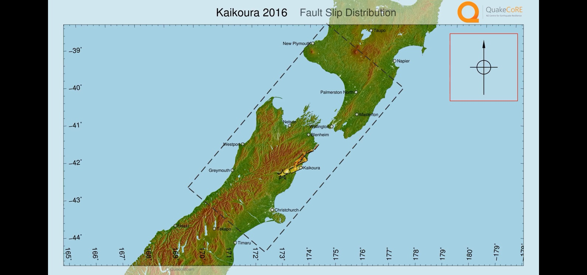
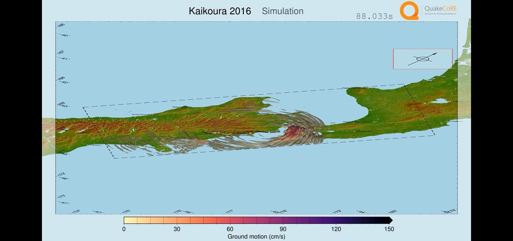
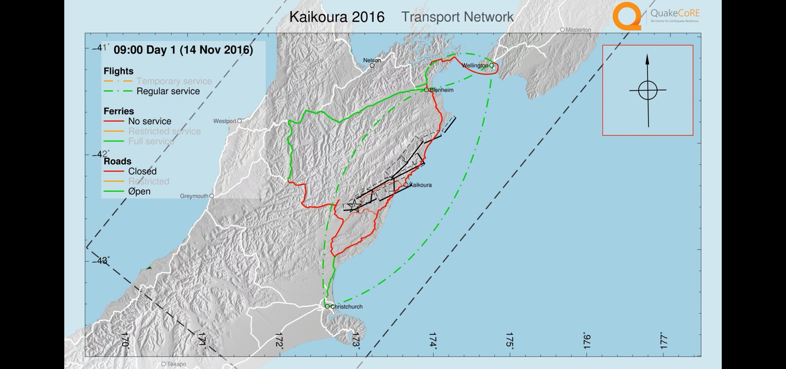

# GMSimViz
Automated 3D Visualization of Ground Motion Simulation with Generic Mapping Tools(GMT)

----------

## Table of contents
   * [Overview] (#overview)
   * [Installation] (#installation)
   * [Tutorial] (tutorial.md)
   * [Issues & Bug Reports] (#issues--bug--reports)
   * [Sample Data] (#sample-data)
   * [Dependencies] (#dependencies)
   * [Thanks] (#thanks)

## Overview
GMSimViz is an automation tool that produces an animated 3D visualization of geological faults, ground motion and other earthquake related data. It uses the Generic Mapping Tools(GMT) to create individual frames, and join them by FFmpeg to create a movie file.

A fully featured result is available at https://youtu.be/qZkOTI4x_cc








## Dependencies
* Python (>=2.6) tested with 2.7
* Numpy for Python 2 (>= 1.10) tested with 1.10 and 1.13
* MPI4Py for Python 2 and associated backend
* H5Py for Python 2 and associated backend
* GMT (>=r19922) requires release after 5.4.3 (currently unavailable) versions prior to r19922 will have bugs but GMSimViz is designed to work with GMT (>=5.2) tested with Ghostscript 9.18, 9.21 was found to produce glitches
* FFMpeg built with image2/png, h.264 encoder support (standard installation) tested with version 3.3
* Qcore library (self-contained)


## Installation
The GMSimViz script requires the installation of dependencies before running.
### Linux
Install the packages for the above mentioned dependencies (qcore library instructions later). Names vary between distribution repositories. For purposes of an example, the package names on Debian are given:\
python2.7 python-numpy python-mpi4py python-h5py gmt ffmpeg

At the time of writing, there is no bug-free version of GMT >= 5.2 for the scope of GMSimViz. It is expected that releases after 5.4.3 will work. Install development versions from the repository, instructions available at http://gmt.soest.hawaii.edu/projects/gmt/wiki/BuildingGMT . Works with r19922 but will likely break in the future with significant changes.

The qcore library is installed with the following command requiring root priviledges in the repository root. **Before installing**, edit the qcore/config.json file so that GMT_DATA has the full path to the resources folder.
```shell
python2 setup.py install
```
On systems where `python2` does not point to the Python 2 installation, try `python` instead.

### Other systems
Currently Unsupported

## Issues & Bug Reports
Various bugs have affected the features of GMT that are used by GMSimViz. There is no release of GMT (from 5.2.1 up to 5.4.3) that works without some issues. The latest tested and working revision is r19922.

## Sample Data
Sample data is provided, it contains smaller data sets from multiple earthquakes to make a feature-full demo. To produce the sample animation with 28 processes, run the following from the repository location upon installation:
```shell
./GMSimViz.py sample_data/fault.srf -a -n28 --title "Sample Animation" --dpi 120 --downscale 8 -x sample_data/xyts.e3d --liquefaction-s sample_data/liquefaction_s.hdf5 --liquefaction-p sample_data/liquefaction_p.hdf5 --landslide-s sample_data/landslide_s.hdf5 --landslide-p sample_data/landslide_p.hdf5 --paths sample_data/transport --temp sample_data/_GMT_WD_PERSPECTIVE_Ez3mF3
```
Change `-n28` to the number of slave processes you want to use. If you don't have python2 in your `env`, you may need to run with `python2 GMSimViz.py` or `python GMSimViz.py` instead of `./GMSimViz.py`. On a systems with 8 cores, `-n7` is a good choice.\
For more details on parameters, run:
```GMSimViz.py -h```

## Thanks

The QuakeCoRE team would like to thank:\
USGS for providing data and software relating liquefaction and landslide analysis.
The Generic Mapping Tools team, especially Paul Wessel for GMT support and quickly fixing issues we ran into while using GMT.
