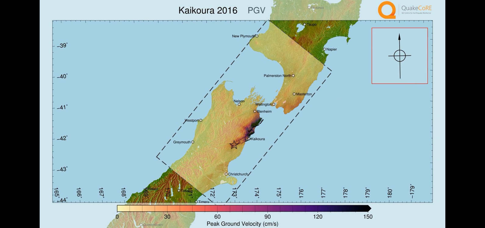
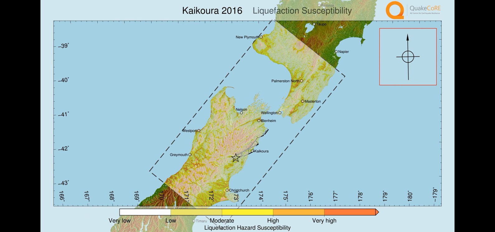

# GMSimViz
Automated 3D Visualization of Ground Motion Simulation with Generic Mapping Tools(GMT)

----------				

## Table of contents
   * [Overview] (#overview)
   * [Installation] (#installation)
   * [Tutorial] (tutorial.md)
   * [Issues & Bug Reports] (#issues--bug--reports)
   * [Sample Data] (#sample-data)
   * [Dependencies] (#dependencies)
   * [Thanks] (#thanks)

## Overview
GMSimViz is an automation tool that produces an animated 3D visualization of geological faults, ground motion and other earthquake related data. It uses the Generic Mapping Tools(GMT) to create individual frames, and join them by FFmpeg to create a movie file.

## Dependencies
* Python (>= 2.6)
* Numpy (>= 1.10)
* GMT (>= r19922)
* FFMpeg (git clone https://git.ffmpeg.org/ffmpeg.git ffmpeg) : Image muxer input mpeg4 container support, h.264 encoder support
* mpi4py
* Qcore library (self-contained)

## Installation
### Ubuntu (or Debian)

### MacOS
Currently unsupported

### Windows
Currently Unsupported

## Issues & Bug Reports

## Sample Data

## Thanks

